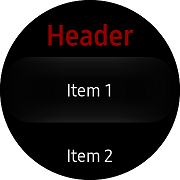
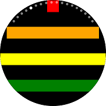

# CircleListView
`CircleListView` is extension of [`Xamarin.Forms.ListView`](https://developer.xamarin.com/api/type/Xamarin.Forms.ListView/).
Same as [`Xamarin.Forms.ListView`](https://developer.xamarin.com/api/type/Xamarin.Forms.ListView/), but Scroller is rendered to [`CircleSurface`](https://developer.tizen.org/development/guides/native-application/user-interface/efl/ui-components/wearable-ui-components/circle-surface). You can also move the List to a bezel interaction.
In order to receive bezel interaction, it must be registered as `RotaryEventConsumer` property of [`CirclePage`](xref:Tizen.Wearable.CircularUI.doc.CirclePage).

||||
|:----------------------------------------------:|:------------------------------------------:|:------------------------------------------------------------:|
|                   Normal list                  |               Group list                   |                      2 texts and 1 icon list                 |

**WARNNING: [CircleListView](xref:Tizen.Wearable.CircularUI.doc.CircleListView), [CircleDateTimeSelector](xref:Tizen.Wearable.CircularUI.doc.CircleDateTimeSelector), [CircleScrollView](xref:Tizen.Wearable.CircularUI.doc.CircleScrollView), [CircleStepper](xref:Tizen.Wearable.CircularUI.doc.CircleStepper) must be contained by `CirclePage` or [CircleSurfaceEffectBehavior](xref:Tizen.Wearable.CircularUI.doc.CircleSurfaceEffectBehavior) should be added in [Behaviors](https://developer.xamarin.com/api/type/Xamarin.Forms.Behavior/) of [Page](https://developer.xamarin.com/api/type/Xamarin.Forms.Page/) that contain these Control. If other `page` contains these control. It may cause exception or control can not be displayed.**

## Adding CircleListView at CirclePage

You can set `CircleListView` at [`CirclePage.Content`](xref:Tizen.Wearable.CircularUI.doc.CirclePage). The following XAML code show CirclePage with `CircleListView`.
`RotaryFocusTargetName` attribute sets the current focused control that is handled by rotating and display the focused control's circle object.
If you don't set this value properly, control can't receive rotary event.

You can put the text in the header, footer, and use the DataTemplate to change the formatting of the text.

For more information. Please refer to below links

- [CircleListView  API reference](https://samsung.github.io/Tizen.CircularUI/api/Tizen.Wearable.CircularUI.Forms.CircleListView.html)
- [Xamarin.Forms.ListView  API reference](https://developer.xamarin.com/api/type/Xamarin.Forms.ListView/)
- [Xamarin.Forms.ListView  Guide](https://docs.microsoft.com/en-us/xamarin/xamarin-forms/user-interface/listview/)

_This guide's code example use WearableUIGallery's TCCircleListView.xaml code at the test\WearableUIGallery\WearableUIGallery\TC\TCCircleListView.xaml_

**XAML file**

```xml
<?xml version="1.0" encoding="utf-8" ?>
<w:CirclePage
    x:Class="WearableUIGallery.TC.TCCircleListView"
    xmlns="http://xamarin.com/schemas/2014/forms"
    xmlns:x="http://schemas.microsoft.com/winfx/2009/xaml"
    xmlns:local="clr-namespace:WearableUIGallery"
    xmlns:sys="clr-namespace:System;assembly=netstandard"
    xmlns:w="clr-namespace:Tizen.Wearable.CircularUI.Forms;assembly=Tizen.Wearable.CircularUI.Forms"
    RotaryFocusTargetName="mylist">
    <w:CirclePage.Content>
        <w:CircleListView x:Name="mylist">
            <w:CircleListView.ItemsSource>
                <x:Array x:Key="array" Type="{x:Type sys:String}">
                    <x:String>Item 1</x:String>
                    <x:String>Item 2</x:String>
                    <x:String>Item 3</x:String>
                    <x:String>Item 4</x:String>
                    <x:String>Item 5</x:String>
                    <x:String>Item 6</x:String>
                    <x:String>Item 7</x:String>
                    <x:String>Item 8</x:String>
                    <x:String>Item 9</x:String>
                    <x:String>Item 10</x:String>
                    <x:String>Item 11</x:String>
                    <x:String>Item 12</x:String>
                </x:Array>
            </w:CircleListView.ItemsSource>
            <w:CircleListView.Header>
                <x:String>Header</x:String>
            </w:CircleListView.Header>
            <w:CircleListView.Footer>
                <x:String>Footer</x:String>
            </w:CircleListView.Footer>
            <w:CircleListView.ItemTemplate>
                <DataTemplate>
                    <TextCell Text="{Binding .}" />
                </DataTemplate>
            </w:CircleListView.ItemTemplate>
            <w:CircleListView.HeaderTemplate>
                <DataTemplate>
                    <Label
                        FontAttributes="Bold"
                        FontSize="Large"
                        HorizontalTextAlignment="Center"
                        Text="{Binding .}"
                        TextColor="Red" />
                </DataTemplate>
            </w:CircleListView.HeaderTemplate>
            <w:CircleListView.FooterTemplate>
                <DataTemplate>
                    <Label
                        FontAttributes="Bold"
                        FontSize="Large"
                        HorizontalTextAlignment="Center"
                        Text="{Binding .}"
                        TextColor="Blue" />
                </DataTemplate>
            </w:CircleListView.FooterTemplate>
        </w:CircleListView>
    </w:CirclePage.Content>
</w:CirclePage>
```