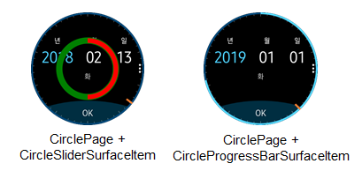
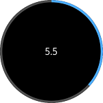
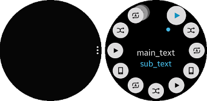
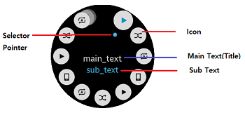

# CirclePage
CirclePage derives from Xamarin.Forms.Page. This visual element occupies all of the wearable screen.

 

## Overview
`CirclePage` is container of any control that use circleObject or rotary event.
if you want to use any circle control or to handle rotary event. you have to use CirclePage.
CirclePage can set bottom button and circle ProgressBar and circle Slider and MoreOption on it's own.

**WARNNING: `CircleListView`, `CircleDateTimeSelector`, `CircleScroller`, `CircleStepper` must be contained by `CirclePage` or `CircleSurfaceEffectBehavior` should be added in `Behaviors` of `Page` that contain these Control. If other `page` contains these control. It may cause exception or control can not be displayed.**


* bottom button 
    - Semicircular button is shown at bottom of screen. refer to below image.

    


* Circle ProgressBar
    - Circle ProgressBar shows the progress status of a given task with the circular design.

    


* Circle Slider
    - Circle Slider changes value corresponding to rotary events. this shows a circle bar at the edge of the circle screen.
You can change radius of circle bar with modifying radius value.

    

* MoreOption
    - More option contains a cue button (shown on the left in the following figure).
     When the cue button is clicked, the rotary selector view opens from the cue location (shown on the right in the figure).
     The rotary selector arranges multiple items around the circular edge of the screen, and switches the focus between items as users rotate the bezel.

    


## Create CirclePage
First, you should download Tizen.Wearalbe.CircularUI nuget package in your application project, please refer to [QuickStart](Quickstart.md).\
Add a new XAML page to the Tizen Xamarin.Forms application, First import Tizen.Wearable.CircularUI.Forms and change the base class from ContentPage to CirclePage. This has to be done in both the C# and XAML.\
In a XAML file. import CircularUI and define namespace like as \
`xmlns:w="clr-namespace:Tizen.Wearable.CircularUI.Forms;assembly=Tizen.Wearable.CircularUI.Forms"`

_This guide's code example use WearableUIGallery's TCCirclePage code at the test\WearableUIGallery\WearableUIGallery\TC\TCCirclePage.xaml_


**C# file**
```cs
using Tizen.Wearable.CircularUI.Forms;
using Xamarin.Forms.Xaml;


namespace WearableUIGallery.TC
{
    [XamlCompilation(XamlCompilationOptions.Compile)]
    public partial class TCCirclePage : CirclePage
    {
        public TCCirclePage()
        {
            InitializeComponent();
        }
    }
}
```

**XAML file**
```xml
<?xml version="1.0" encoding="utf-8" ?>
<w:CirclePage
    x:Class="WearableUIGallery.TC.TCCirclePage"
    xmlns="http://xamarin.com/schemas/2014/forms"
    xmlns:x="http://schemas.microsoft.com/winfx/2009/xaml"
    xmlns:local="clr-namespace:WearableUIGallery.TC"
    xmlns:w="clr-namespace:Tizen.Wearable.CircularUI.Forms;assembly=Tizen.Wearable.CircularUI.Forms"
    RotaryFocusTargetName="{Binding RotaryFocusName}">
    <w:CirclePage.Content>

```

## Adding Content at CirclePage
You can set content at `CirclePage.Content`. The following XAML code show CirclePage set content with `CircleDateTimeSelector`.
`RotaryFocusTargetName` attribute set the current focused control that is handle by rotating and display the focused control's circle object.
If you don't set this value properly. Control can't receive rotary event or circle object can't be shown.

For more information . Please refer to [CirclePage API reference](https://github.sec.samsung.net/pages/dotnet/tizen-circular-ui/api/Tizen.Wearable.CircularUI.Forms.CirclePage.html)

**XAML file**
```xml
<w:CirclePage
    x:Class="WearableUIGallery.TC.TCCirclePage"
    xmlns="http://xamarin.com/schemas/2014/forms"
    xmlns:x="http://schemas.microsoft.com/winfx/2009/xaml"
    xmlns:local="clr-namespace:WearableUIGallery.TC"
    xmlns:w="clr-namespace:Tizen.Wearable.CircularUI.Forms;assembly=Tizen.Wearable.CircularUI.Forms"
    RotaryFocusTargetName="{Binding RotaryFocusName}">
    <w:CirclePage.BindingContext>
        <local:TCCirclePageViewModel />
    </w:CirclePage.BindingContext>
    <w:CirclePage.Content>
        <StackLayout
            BackgroundColor="Black"
            HorizontalOptions="FillAndExpand"
            Orientation="Vertical"
            VerticalOptions="FillAndExpand">
            <w:CircleDateTimeSelector
                x:Name="DateSelector"
                IsVisibleOfDate="{Binding DateVisiblity}"
                MaximumDate="1/1/2020"
                MinimumDate="1/12/2015"
                ValueType="Date" />
        </StackLayout>
    </w:CirclePage.Content>

```

## Adding ActionButtonItem at CirclePage
`ActionButtonItem` in CirclePage presents bottom button. ActionButtonItem derive from `Xamarin.Forms.Menuitem`.

`ActionButtonItem` has the following properties:
- `Command` : Gets or sets the `ICommand` to be invoked on activation(item clicked).
- `Text` : Gets or sets button's text.

For more information . Please refer to [ActionButtonItem  API reference](https://github.sec.samsung.net/pages/dotnet/tizen-circular-ui/api/Tizen.Wearable.CircularUI.Forms.ActionButtonItem.html)

**XAML file**
```xml
    <w:CirclePage.ActionButton>
        <w:ActionButtonItem Command="{Binding ProgressBarVisibleCommand}" Text="OK" />
    </w:CirclePage.ActionButton>
```

## Adding ToolbarItems at CirclePage
CirclePage `ToolbarItems` set rotary selector view's items. You can set each item with `CircleToolbarItem` property.\
CircleToolbarItem derive from `Xamarin.Forms.ToolbarItem`. 

`CircleToolbarItem` has the following properties:
- `Command` : Gets or sets the `ICommand` to be invoked on activation(item clicked).
- `Icon` : Gets or sets item's image.
- `Text` : Gets or sets item's title.


For more information . Please refer to [CircleToolbarItem  API reference](https://github.sec.samsung.net/pages/dotnet/tizen-circular-ui/api/Tizen.Wearable.CircularUI.Forms.CircleToolbarItem.html)



**XAML file**
```xml
    <w:CirclePage.ToolbarItems>
        <w:CircleToolbarItem
            Command="{Binding Play.Action}"
            Icon="{Binding Play.Icon}"
            SubText="{Binding Play.SubText}"
            Text="{Binding Play.Text}" />
        <w:CircleToolbarItem
            Command="{Binding Stop.Action}"
            Icon="{Binding Stop.Icon}"
            SubText="{Binding Stop.SubText}"
            Text="{Binding Stop.Text}" />

    ...

    </w:CirclePage.ToolbarItems>
```

## Adding CircleProgressBarSurfaceItem at CirclePage
CirclePage `CircleSurfaceItems`  can set `CircleProgressBarSurfaceItem` and `CircleSliderSurfaceItem`.\
`CircleProgressBarSurfaceItem` represent Circle ProgressBar.`progress1` at XAML code represents outter circle of below image. and `progress2` represents inner circle.\
If you use CircleProgressbar, you don't need to set `RotaryFocusTargetName` property of CirclePage.
When `Value` property is incread or decrease. circle object extend or shrink following to `Value` property. 

`CircleProgressBarSurfaceItem` has the following properties:
- `Value` : Gets or sets the value of the progressbar..
- `IsVisible` : Gets or sets the visibility value of circle surface item.
- `BarRadius` : Gets or sets the bar radius value.
- `BackgroundRadius` : Gets or sets the background radius value.
- `BarLineWidth` : Gets or sets the bar line width value.
- `BackgroundLineWidth` : Gets or sets the background line width value.
- `BarColor` : Gets or sets the bar color value.
- `BackgroundLineWidth` : Gets or sets the background color value.

For more information . Please refer to [CircleSurfaceItem  API reference](https://github.sec.samsung.net/pages/dotnet/tizen-circular-ui/api/Tizen.Wearable.CircularUI.Forms.CircleSurfaceItem.html)


_This guide's code example use XUIComponent's CircleProgressBar.xaml code at the sample\XUIComponents\UIComponents\UIComponents\Samples\CircleProgressBar.xaml_

**XAML file**
```xml
<w:CirclePage
    x:Class="UIComponents.Samples.CircleProgressBar"
    xmlns="http://xamarin.com/schemas/2014/forms"
    xmlns:x="http://schemas.microsoft.com/winfx/2009/xaml"
    xmlns:local="clr-namespace:UIComponents.Samples"
    xmlns:sys="clr-namespace:System;assembly=netstandard"
    xmlns:w="clr-namespace:Tizen.Wearable.CircularUI.Forms;assembly=Tizen.Wearable.CircularUI.Forms"
    NavigationPage.HasNavigationBar="False">
    <w:CirclePage.BindingContext>
        <local:CircleProgressBarViewModel />
    </w:CirclePage.BindingContext>
    <w:CirclePage.Content>
        <StackLayout
            Padding="0,30,0,0"
            BackgroundColor="Black"
            HorizontalOptions="Center"
            Orientation="Vertical"
            VerticalOptions="FillAndExpand">
            <Label
                x:Name="label1"
                FontAttributes="Bold"
                FontSize="12"
                Text="{Binding ProgressLabel1}"
                TextColor="White" />
            <Label
                x:Name="label2"
                Margin="0,40"
                FontAttributes="Bold"
                FontSize="12"
                Text="{Binding ProgressLabel2}"
                TextColor="White" />
        </StackLayout>
    </w:CirclePage.Content>
    <w:CirclePage.CircleSurfaceItems>
        <w:CircleProgressBarSurfaceItem
            x:Name="progress1"
            IsVisible="True"
            Value="{Binding ProgressValue1}" />
        <w:CircleProgressBarSurfaceItem
            x:Name="progress2"
            BackgroundColor="Black"
            BackgroundLineWidth="15"
            BackgroundRadius="70"
            BarColor="Red"
            BarLineWidth="15"
            BarRadius="70"
            IsVisible="True"
            Value="{Binding ProgressValue2}" />
    </w:CirclePage.CircleSurfaceItems>
</w:CirclePage>
```
